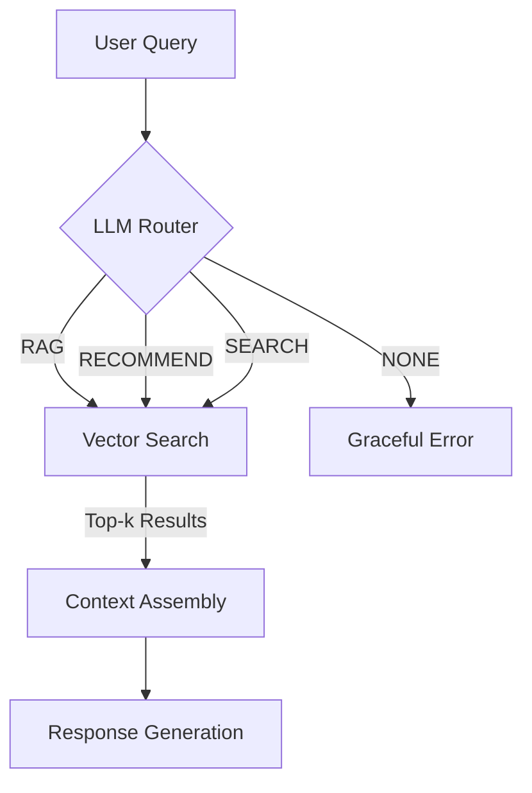
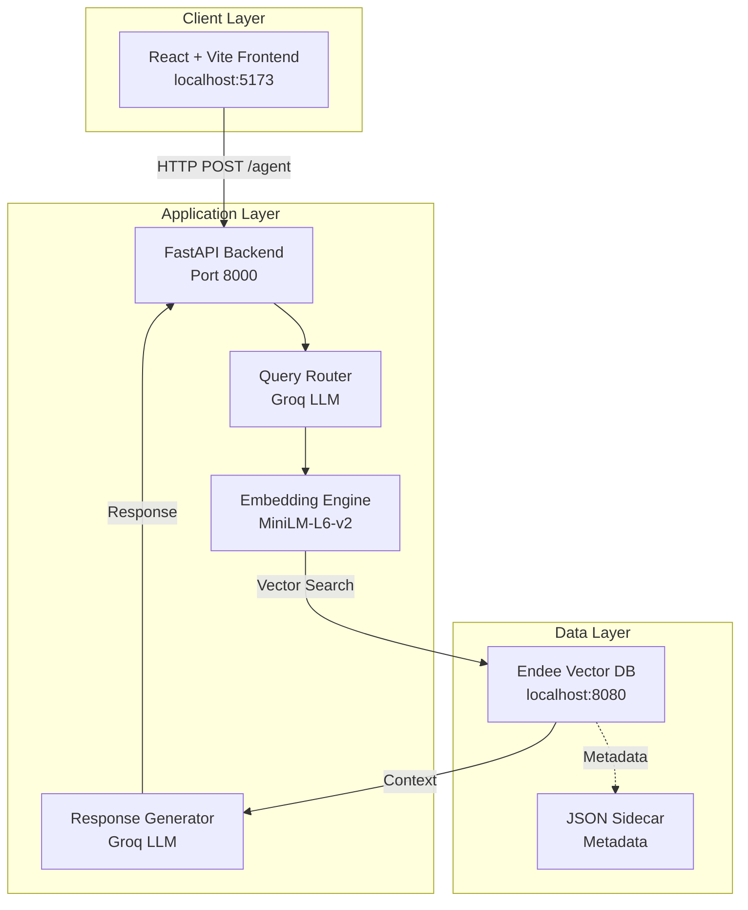

<div align="center">

# CineBot — AI Movie Discovery Agent

### Semantic Search & RAG-Powered Movie Recommendation System

[](https://github.com/EndeeLabs/endee)
[](https://python.org)
[](https://react.dev)
[](https://fastapi.tiangolo.com)

*A full-stack AI application demonstrating the power of vector search in building intelligent, context-aware movie recommendation systems.*

[Features](#-key-features) • [Architecture](#-system-architecture) • [Installation](#-installation) • [Usage](#-usage) • [API](#-api-documentation)

</div>

---

## Project Overview

**CineBot** is an intelligent movie discovery agent that leverages **[Endee](https://github.com/EndeeLabs/endee)** — a high-performance vector database — to deliver semantic search, retrieval-augmented generation (RAG), and personalized recommendations through natural language conversation.

### Problem Statement

Traditional movie search engines rely on exact keyword matching, failing when users describe movies conceptually (e.g., *"that sci-fi movie where time goes backwards"*). Users often struggle to find content when they recall plot points, themes, or "vibes" rather than specific titles or actors.

**CineBot solves this by using vector embeddings to understand the *meaning* behind a query, not just the words.** By mapping both movies and user queries into a shared 384-dimensional vector space, CineBot identifies semantic relationships that keyword search misses completely.

### Technical Approach

CineBot employs a hybrid AI pipeline:
1.  **Intent Classification**: An LLM router determines if a query is a specific question (RAG), a general request (Recommendation), or a direct lookup (Search).
2.  **Semantic Retrieval**: The **Endee Vector Database** performs high-speed similarity searches to find relevant movie contexts.
3.  **Generative Synthesis**: For complex queries, an LLM synthesizes the retrieved context into a natural language response.

---

## Key Features

### **Semantic Vector Search**
Traditional keyword search fails when users describe movies conceptually. CineBot encodes queries into dense vector embeddings using `all-MiniLM-L6-v2` and performs similarity search against the Endee vector index, enabling queries like:
- *"Movie where reality isn't real"* → **The Matrix**
- *"Romance on a sinking ship"* → **Titanic**
- *"A chef who happens to be a rat"* → **Ratatouille**

### **Intelligent Query Router**
An LLM-based router (Groq `llama-3.3-70b-versatile`) analyzes each user query and routes it to the optimal processing pipeline:



### **Conversational Interface**
A modern React chat interface provides real-time interaction with the AI agent, featuring auto-scroll, loading states, and tool usage transparency.

---

## System Architecture



### Data Flow

1. **User submits a natural language query** via the React chat interface
2. **Query Router (LLM)** classifies the intent → `RAG`, `RECOMMEND`, `SEARCH`, or `NONE`
3. **Embedding Engine** encodes the query into a 384-dimensional vector
4. **Endee Vector DB** performs k-NN similarity search and returns top matches
5. **Response Generator** synthesizes the final answer using retrieved context
6. **Response** is rendered in the chat UI with tool usage transparency

## How Endee is Used

Endee serves as the long-term semantic memory for the application.

1.  **Vector Storage**: Movie descriptions are converted into dense vectors using `all-MiniLM-L6-v2` and stored in Endee.
2.  **Similarity Search**: When a user queries the system, their input is embedded into the same vector space. Endee calculates the cosine similarity to find the closest matching movies.

**Code Example:**
```python
# 1. Embed the user's query
query_vector = embedding_model.encode(user_message).tolist()

# 2. Search Endee for the top 3 most similar movies
response = requests.post(f"{ENDEE_BASE}/index/movies/search", json={
    "vector": query_vector, 
    "k": 3
})

# 3. Retrieve context for RAG
closest_movies = response.json()
```

---

## Technology Stack

### Backend

| Component | Technology | Purpose |
|-----------|------------|---------|
| **Web Framework** | FastAPI | Async REST API with automatic OpenAPI documentation |
| **Vector Database** | [Endee](https://github.com/EndeeLabs/endee) | High-performance vector storage and similarity search |
| **Embeddings** | Sentence Transformers (`all-MiniLM-L6-v2`) | Convert text to 384-dim dense vectors |
| **LLM Provider** | Groq (`llama-3.3-70b-versatile`) | Query routing and RAG response generation |
| **Validation** | Pydantic | Request/response schema enforcement |

### Frontend

| Component | Technology | Purpose |
|-----------|------------|---------|
| **UI Framework** | React 19 | Component-based reactive interface |
| **Build Tool** | Vite 7 | Fast HMR and optimized production builds |
| **HTTP Client** | Axios | Promise-based API communication |
| **Styling** | Vanilla CSS | WhatsApp-inspired chat aesthetics |

---

## Installation

### Prerequisites

- Python 3.9 or higher
- Node.js 18 or higher
- [Endee Vector Database](https://github.com/EndeeLabs/endee) (running on port 8080)
- Groq API Key ([Get one here](https://console.groq.com/))

### Step 1: Clone the Repository

```bash
git clone https://github.com/lavdeep2332/Endee.git
cd Endee
```

### Step 2: Set Up Endee Vector Database

Follow the [Endee installation guide](https://github.com/EndeeLabs/endee#installation) to get the vector database running:

```bash
# Clone Endee
git clone https://github.com/EndeeLabs/endee.git
cd endee

# Follow Endee's setup instructions to start the server on port 8080
```

### Step 3: Configure Backend

```bash
cd backend

# Create virtual environment
python -m venv venv

# Activate (Windows)
venv\Scripts\activate

# Activate (macOS/Linux)
source venv/bin/activate

# Install dependencies
pip install -r ../requirements.txt
```

**Configure API Keys** in `main.py`:
```python
GROQ_API_KEY = "your-groq-api-key-here"
```

**Start the Backend Server:**
```bash
uvicorn main:app --reload --host 0.0.0.0 --port 8000
```

### Step 4: Configure Frontend

```bash
cd frontend

# Install dependencies
npm install

# Start development server
npm run dev
```

### Step 5: Access the Application

| Service | URL |
|---------|-----|
| **Frontend** | http://localhost:5173 |
| **Backend API** | http://localhost:8000 |
| **API Documentation** | http://localhost:8000/docs |
| **Endee Vector DB** | http://localhost:8080 |

---

## Usage

### Example Interactions

| Query | Tool Used | Response |
|-------|-----------|----------|
| *"Find me a movie about dreams"* | `SEARCH` | Inception: A thief enters dreams to steal secrets |
| *"What's The Matrix about?"* | `RAG` | A hacker named Neo discovers that reality... |
| *"Recommend a romantic movie"* | `RECOMMEND` | Titanic: A romance disaster film about a sinking ship |
| *"rat chef"* | `SEARCH` | Ratatouille: A rat who can cook in Paris |

### Adding Custom Movies

Movies can be added programmatically. The backend automatically populates initial movies on startup, but you can extend the dataset:

```python
add_movie_to_system("mov_6", "Your Movie: Description of the movie plot and themes.")
```

---

## API Documentation

### `POST /agent`

Process a natural language query through the AI agent pipeline.

**Request:**
```json
{
  "message": "Find me a sci-fi movie about reality"
}
```

**Response:**
```json
{
  "response": "Found these movies:\n\n- The Matrix: A hacker discovers reality is a simulation.",
  "tool_used": "SEARCH"
}
```

### Query Classification

| Tool | Trigger | Behavior |
|------|---------|----------|
| `RAG` | Specific questions about movie content | Vector search + LLM answer synthesis |
| `RECOMMEND` | General preference-based requests | Vector search + formatted suggestions |
| `SEARCH` | Title or keyword searches | Vector search + top-k results |
| `NONE` | Unrelated/gibberish input | Graceful error message |

---

## Project Structure

```
Endee/
├── backend/
│   ├── main.py              # FastAPI application & AI agent logic
│   ├── movies_db.json       # JSON sidecar for text storage
│   ├── test.py              # Unit tests
│   ├── sync_test.py         # Integration tests
│   └── Venv/                # Python virtual environment
│
├── frontend/
│   ├── src/
│   │   ├── App.jsx          # Main chat component
│   │   ├── App.css          # Chat interface styling
│   │   ├── main.jsx         # React entry point
│   │   └── index.css        # Global styles
│   ├── public/              # Static assets
│   ├── index.html           # HTML template
│   ├── package.json         # Node.js dependencies
│   └── vite.config.js       # Vite configuration
│
├── requirements.txt         # Python dependencies
└── README.md                # Project documentation
```

---

## Configuration Reference

| Variable | File | Default | Description |
|----------|------|---------|-------------|
| `ENDEE_BASE` | `main.py` | `http://localhost:8080/api/v1` | Endee API endpoint |
| `INDEX_NAME` | `main.py` | `movies` | Vector index name in Endee |
| `GROQ_API_KEY` | `main.py` | — | Groq API key (required) |
| `STORAGE_FILE` | `main.py` | `movies_db.json` | Path to JSON sidecar storage |

---

## Testing

```bash
# Run backend tests
cd backend
python -m pytest test.py -v

# Run sync tests
python sync_test.py
```

---

## Future Enhancements

- Expand movie dataset with TMDB integration
- Add user authentication and personalized history
- Implement conversation memory for multi-turn interactions
- Deploy with Docker Compose for simplified setup
- Add support for multilingual queries

---

## References

- [Endee Vector Database](https://github.com/EndeeLabs/endee) — Core vector storage engine
- [Sentence Transformers](https://www.sbert.net/) — Text embedding models
- [Groq](https://groq.com/) — Ultra-fast LLM inference
- [FastAPI](https://fastapi.tiangolo.com/) — Modern Python web framework
- [React](https://react.dev/) — UI component library
- [Vite](https://vitejs.dev/) — Next-generation frontend tooling

---

## Author

**Lavdeep Kumar Tiwari**

- GitHub: [@lavdeep2332](https://github.com/lavdeep2332)

---
<div align="center">

**Built with [Endee](https://github.com/EndeeLabs/endee) — High-Performance Vector Search**

</div>
